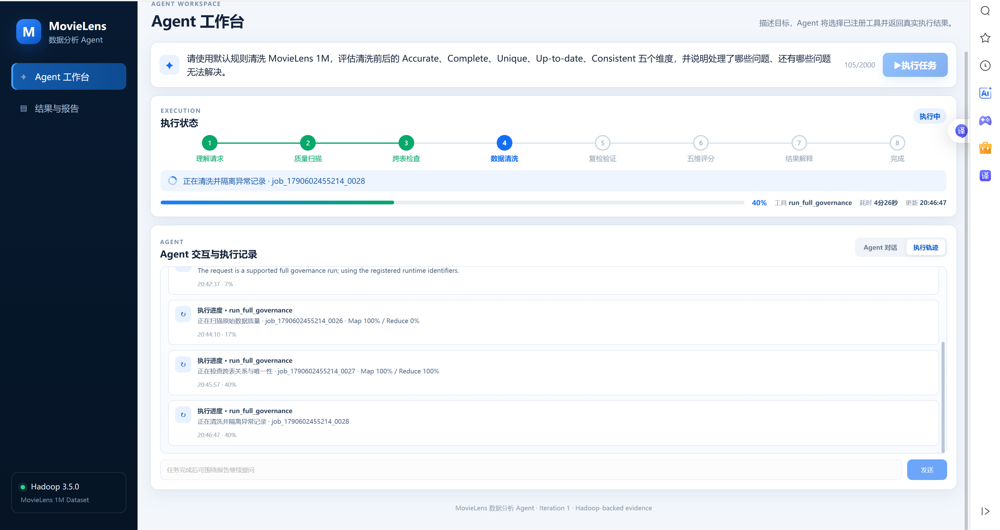
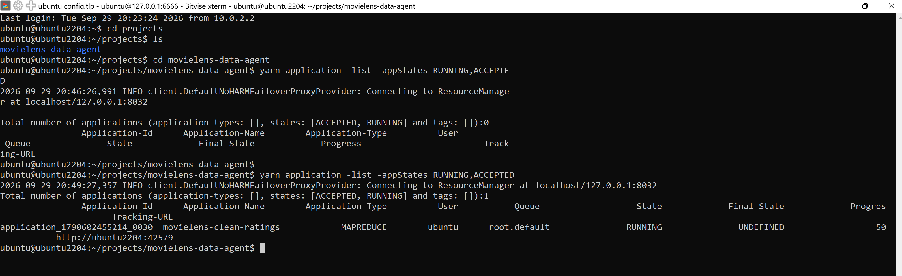
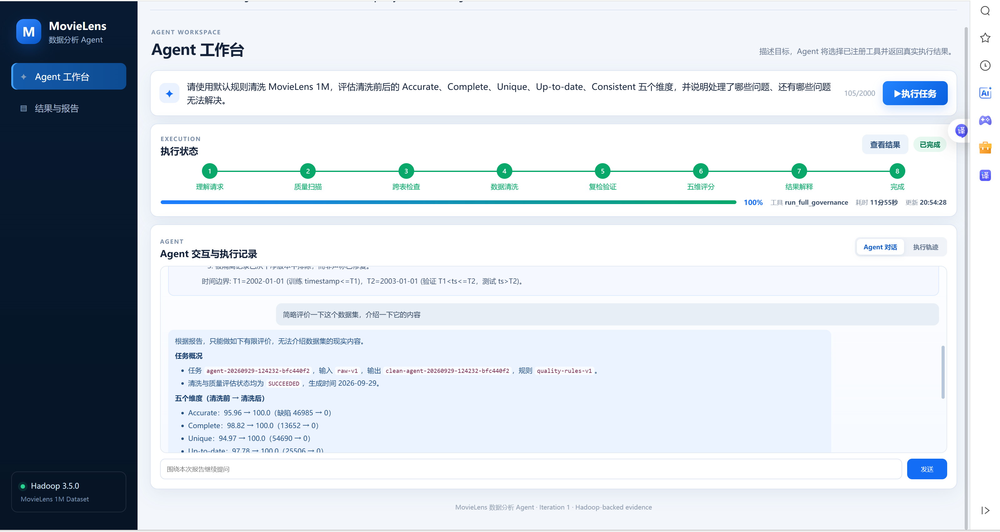
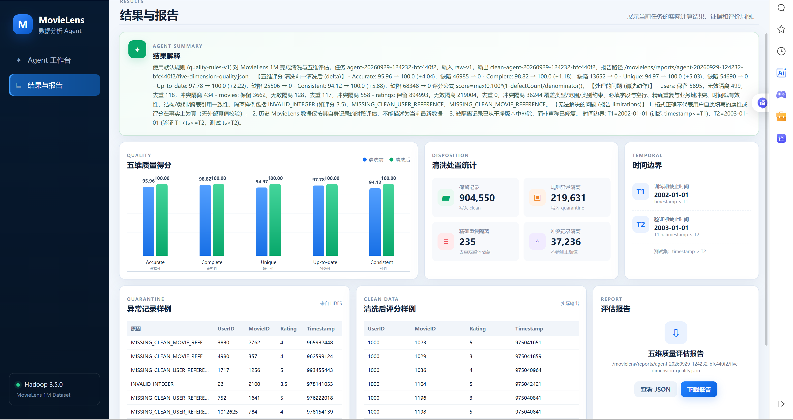
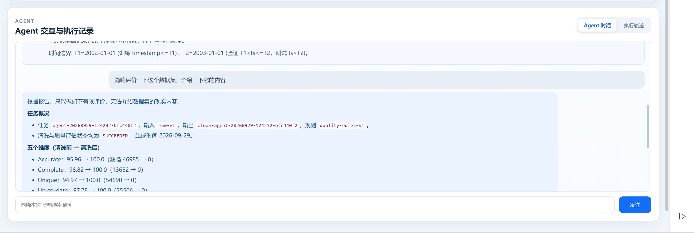

# MovieLens 数据分析 Agent——迭代一实验报告

## 基本信息

| 项目 | 内容 |
| --- | --- |
| 课程 | 大数据分析 |
| 实验名称 | Agent 驱动的 Hadoop 数据清洗与五维质量评估 |
| 姓名 | 刘馨雅 |
| 学号 | 241250088 |
| 组名 | Nutshell |
| 小组人数 | 1人 |
| 实验日期 | 2026 年 9 月 29 日 |

## 1. 实验目标

本实验使用 MovieLens 1M 数据集，实现一个数据治理 Agent。用户在网页中输入自然语言请求后，Agent 自动选择 Hadoop 工具，完成数据质量扫描、数据清洗、清洗后复检和五维质量评分。

实验需要达到以下目标：

1. 使用 Hadoop 实际处理数据，而不是使用模拟结果。
2. 对清洗前后的数据进行 Accurate、Complete、Unique、Up-to-date、Consistent 五个维度的评分。
3. 保存原始数据版本、清洗版本、规则版本、任务标识和评估报告。
4. 展示任务进度、清洗结果、异常样例和评分变化。
5. 支持用户围绕本次报告继续向 Agent 提问。

## 2. 实验环境

| 组件 | 实验环境 |
| --- | --- |
| 开发系统 | Windows 11 |
| 运行系统 | VirtualBox Ubuntu 24.04 LTS |
| Java | OpenJDK 17 |
| Maven | Maven Wrapper 3.9.14 |
| Hadoop | Hadoop 3.5.0，单节点伪分布式模式 |
| Web 后端 | Spring Boot 4.1.0 |
| Agent 模型接口 | DeepSeek，兼容 OpenAI API 格式 |
| 数据集 | MovieLens 1M |

HDFS、YARN、MapReduce 和 Agent 后端在 Ubuntu 中运行，Windows 用于开发、Git 管理和浏览器访问。

## 3. 实现方法

### 3.1 Agent 执行流程

本系统使用以下 Agent 流程：

```text
用户请求
  → Agent 理解任务
  → 选择已注册工具
  → Hadoop 执行数据处理
  → Agent 读取工具结果
  → Agent 解释报告并回答追问
```

迭代一注册的工具为 `run_full_governance`。工具执行五个 Hadoop 阶段：

1. 扫描原始数据的格式、必填项、类型和取值范围。
2. 检查重复记录、业务键冲突和跨表引用。
3. 清洗数据，并将无法安全修复的记录写入隔离区。
4. 使用相同规则复检清洗后的数据。
5. 生成五维评分和最终 JSON 报告。

### 3.2 数据处置方法

- 合法记录写入 clean 目录。
- 非法格式、非法取值、断链和时间越界记录写入 quarantine 目录。
- 精确重复记录只保留一条。
- 同一业务键存在不同内容时，将相关冲突记录全部隔离。
- 系统不猜测无法确定的正确值，也不把隔离表述为修复。

### 3.3 五维评分方法

五个维度统一使用以下公式：

```text
score = max(0, 100 × (1 - defectCount / denominator))
```

| 维度 | 本实验中的含义 |
| --- | --- |
| Accurate | 检查类型、范围和已知类别是否合法。 |
| Complete | 检查必填字段和空行是否缺失。 |
| Unique | 检查精确重复和业务键冲突。 |
| Up-to-date | 检查时间戳是否位于 MovieLens 的历史覆盖范围内。 |
| Consistent | 检查结构、类别、跨表引用和业务键是否一致。 |

清洗前后使用同一套规则，保证分数可以比较。

时间边界固定为：

- `T1 = 2002-01-01T00:00:00Z`，训练数据满足 `timestamp <= T1`。
- `T2 = 2003-01-01T00:00:00Z`，验证数据满足 `T1 < timestamp <= T2`，测试数据满足 `timestamp > T2`。

## 4. 实验过程

### 4.1 启动 Hadoop

```bash
start-dfs.sh
start-yarn.sh
mapred --daemon start historyserver
jps
```

`jps` 显示 NameNode、DataNode、ResourceManager、NodeManager 和 JobHistoryServer 后，说明基础服务已启动。

### 4.2 配置 API-key

本系统的 api 接入设计以 DeepSeek 为主，兼容 OpenAI 风格
```bash
export LLM_API_KEY="你的 DeepSeek API Key"
export LLM_PROVIDER="deepseek"
export LLM_BASE_URL="https://api.deepseek.com"
export LLM_MODEL="deepseek-v4-flash"
```

输入成功后，可使用以下命令判断key设置是否成功
```bash
# 密钥成功设置则输出OK
if [ -n "${LLM_API_KEY:-${DEEPSEEK_API_KEY:-}}" ]; then
  echo "LLM_KEY_OK"
else
  echo "LLM_KEY_MISSING"
fi
```
以及检查模型属性

```bash
echo "${LLM_PROVIDER:-deepseek}"
echo "${LLM_BASE_URL:-https://api.deepseek.com}"
echo "${LLM_MODEL:-deepseek-v4-flash}"
```


### 4.3 启动 Agent 系统

```bash
./mvnw clean package
java -jar web-app/target/web-app-0.1.0-SNAPSHOT.jar
```

浏览器访问 `http://localhost:18080`，输入：

> 请使用默认规则清洗 MovieLens 1M，评估清洗前后的 Accurate、Complete、Unique、Up-to-date、Consistent 五个维度，并说明处理了哪些问题、还有哪些问题无法解决。

### 4.4 查看执行过程

页面依次显示理解请求、质量扫描、跨表检查、数据清洗、复检验证、五维评分、结果解释和完成八个阶段，同时显示当前工具、进度和更新时间。



### 4.5 Hadoop 运行证据

运行过程中使用以下命令查看 YARN 任务：

```bash
yarn application -list -appStates RUNNING,ACCEPTED
yarn application -list -appStates ALL
```


## 5. 实验结果

### 5.1 任务信息

| 项目 | 实际结果 |
| --- | --- |
| 任务 ID | `agent-20260929-124232-bfc440f2` |
| 输入版本 | `raw-v1` |
| 输出版本 | `clean-agent-20260929-124232-bfc440f2` |
| 规则版本 | `quality-rules-v1` |
| 任务状态 | `SUCCEEDED` |
| 总耗时 | 约 11 分 55 秒 |
| 最终报告 | `/movielens/reports/agent-20260929-032906-6d7d4ffc/five-dimension-quality.json` |




### 5.2 五维质量评分

| 维度 | 清洗前 | 清洗后 | 提升 |
| --- | ---: | ---: | ---: |
| Accurate | 95.96 | 100.00 | +4.04 |
| Complete | 98.82 | 100.00 | +1.18 |
| Unique | 94.97 | 100.00 | +5.03 |
| Up-to-date | 97.78 | 100.00 | +2.22 |
| Consistent | 94.12 | 100.00 | +5.88 |

清洗后五个维度均为 100 分，表示进入 clean 版本的记录全部通过了当前规则检查。它不表示数据在现实世界中一定完全真实。

### 5.3 清洗处置统计

| 数据表 | 写入 clean | 非法记录隔离 | 精确重复移除 | 冲突记录隔离 |
| --- | ---: | ---: | ---: | ---: |
| users | 5,895 | 499 | 118 | 434 |
| movies | 3,662 | 128 | 117 | 558 |
| ratings | 894,993 | 219,004 | 0 | 36,244 |
| 合计 | 904,550 | 219,631 | 235 | 37,236 |

系统在异常样例中发现了以下问题：

- `MISSING_CLEAN_MOVIE_REFERENCE`：评分引用的电影不在清洗后的电影表中。
- `MISSING_CLEAN_USER_REFERENCE`：评分引用的用户不在清洗后的用户表中。
- `INVALID_INTEGER`：评分等应为整数的字段出现了非整数，例如评分 `3.5`。



### 5.4 Agent 结果追问

任务完成后，用户可以围绕本次报告继续提问。Agent 的回答只使用当前任务报告中的实际内容；对于报告没有提供的信息，Agent 会明确说明无法判断。



## 6. 结果分析

清洗后五维得分均有提高，其中 Consistent 提升最多，为 5.88 分；Unique 提升 5.03 分；Accurate 提升 4.04 分。这说明原始数据中的主要问题集中在记录冲突、重复、格式和跨表引用方面。

Complete 的提升较小，为 1.18 分，说明缺失问题相对少一些。Up-to-date 提升 2.22 分，但这里的“时效性”只表示时间戳符合 MovieLens 历史数据的覆盖范围，不表示数据相对当前日期是新的。

清洗过程没有随意修改无法确定的值，而是将这些记录隔离。这样会减少 clean 数据量，但能保证清洗结果可解释，也能保留异常记录供后续检查。

## 7. 实验中遇到的问题

### 7.1 Hadoop 任务执行时间较长

最初前端只能显示“正在执行”，用户无法判断具体进度。后来增加了八阶段状态、Hadoop Job ID、Map/Reduce 进度、当前工具和更新时间。本次任务最终用时约 11 分 55 秒，运行过程可以被持续观察。

### 7.2 前端报告没有正确显示

早期版本直接返回了不兼容的 JSON 树对象，导致前端只能看到类型标志，无法读取实际评分。修正为普通 Map/List 数据后，报告、图表、统计和样例能够正常显示。

### 7.3 Agent 回复中的 Markdown 原样显示

Agent 的追问回复包含标题、列表和粗体标记，旧页面使用纯文本显示。当前版本增加了安全的 Markdown 渲染，并先转义 HTML，避免直接执行模型返回的页面代码。

## 8. 已知限制

1. MovieLens 用户属性由用户自愿填写，格式正确不能证明内容真实。
2. MovieLens 1M 是历史数据，不能描述为当前最新数据。
3. 被隔离的记录只是从 clean 版本中排除，并没有被修复。
4. 当前为单节点教学环境，没有测试多节点性能和容错能力。
5. 当前任务状态保存在应用内存中，应用重启后需要通过 HDFS 路径查找旧报告。
6. 本轮只实现数据治理工具，分类、聚类、降维和图分析将在后续迭代加入。

## 9. 实验结论

本实验完成了一个能够真实调用 Hadoop 的 MovieLens 数据治理 Agent。用户通过一次自然语言请求即可完成数据扫描、清洗、复检和五维评分，并在前端查看执行进度、实际结果、异常样例和评估报告。

本次真实任务成功生成了清洗版本和质量报告，五个维度的得分均有提升。系统也能区分修复、去重和隔离，并对无法验证的问题给出限制说明。迭代一的清洗数据版本和 `T1/T2` 时间边界可以继续供后续分类、聚类、降维和知识图谱任务使用。
